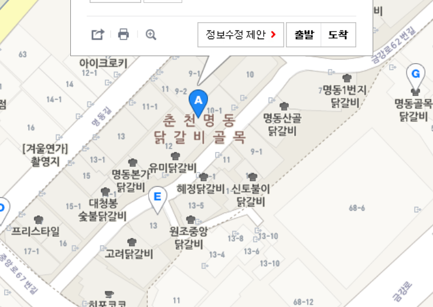

# 춘천 여행 

## 목차

[예약 정보](#예약-정보)

[경유지](#경유지)

[테이블 정보](#테이블-정보)

### 예약 정보

| 예약   | 시간                   | 내용                             |
| ------ | ---------------------- | -------------------------------- |
| 그린카 | 8월 10일 11:00 ~ 22:00 | [위치](http://naver.me/F7228eb5), 01하0426, [방법](https://m.blog.naver.com/PostView.nhn?blogId=greencar_co&logNo=220747439416&proxyReferer=https%3A%2F%2Fwww.google.com%2F) |
|기차	| 8월 10일 9:19 ~10:38	| 용산 ITX 청춘 2071 |
|춘천 HOTEL 이튼	| 8월 10일 18:00 ~ 11일 12:00	| [위치](http://naver.me/FYJJQZFh), 야놀자 |

### 경유지

라모스 버거 혹은 에서 점심을 먹은 후, 

옥산가에 가면 찜질방(옥 동굴 체험장), 그(림같은)빵집, 권진규 미술관 등 조금 볼거리가 있는것 같다.

통나무집 닭갈비를 조금 일찍 먹어야 산토리니에서 저녁노을을 볼 수 있을 것같다.

춘천 통나무집 닭갈비에 사람이 많아 못 먹을 수 있는데, 밑의 지도를 보면 닭갈비 집이 많다. (나중에 춘천 시청 근처의 닭갈비 집을 가도 좋을 것 같다.)

### 테이블 정보

| 시간       | 장소                                                          | etc                                                          |
| --------- | ---------|--------------------------------------------------- |
| 점심 먹고 | [카페 감자밭](https://store.naver.com/restaurants/detail?id=1823037411) | [review](http://julssam.blog.me/221529848044)                |
| 저녁 야식 | [대원당 빵집](http://naver.me/FEe4VFkp)                      | [review](http://blog.naver.com/PostView.nhn?blogId=ailine&logNo=220961273816&parentCategoryNo=&categoryNo=3&viewDate=&isShowPopularPosts=true&from=search) |
|           | 유기농 카페                                                  |                                                              |
|           | 청평사 소양강 댐                                             |                                                              |
|       | 팬더하우스(떡볶이 집)                                        |                                                              |
|       | [옥광산 그빵집(옥산가)](https://blog.naver.com/so6198/221245638852) |                                                              |
|       | [춘천 라모스 버거](https://blog.naver.com/whgiddnjs/221349385972) | [review](https://businesstripman.tistory.com/4)              |
|       | 함흥냉면옥                                                   |                                                              |
|       | [춘천 통나무집 닭갈비](https://blog.naver.com/lovelyjjan/221587634698) | 주문 PM 8:30 까지 (사람多) |
| | 춘천 닭갈비 골목 | [지도](http://naver.me/FWLmkYk7) |
|  | 춘천 산토리니 | |

엄지$\color{red}{ \text{♥}}$성욱